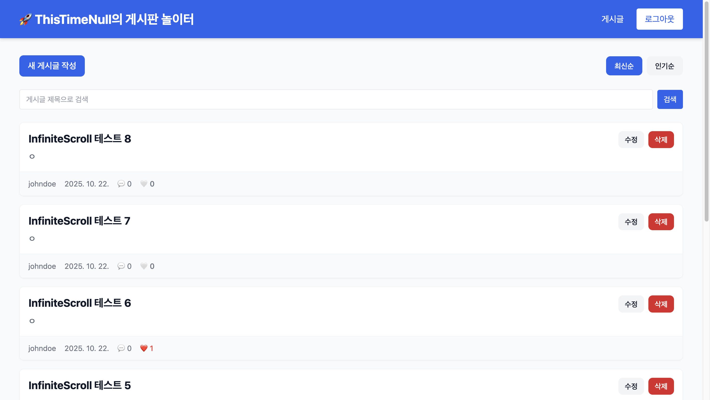
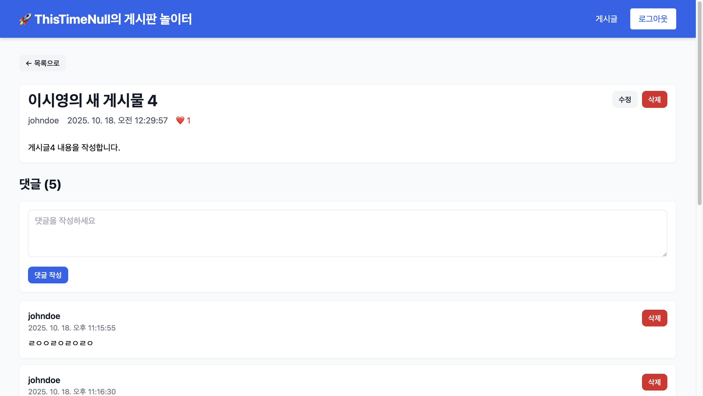
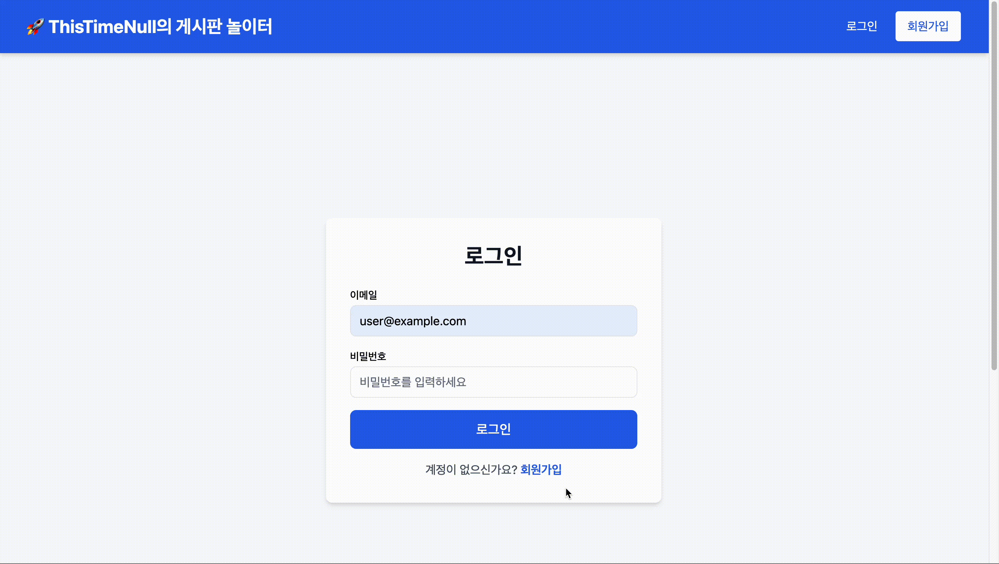
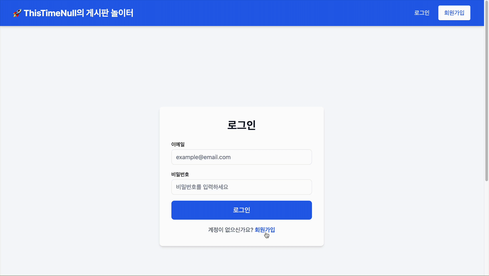
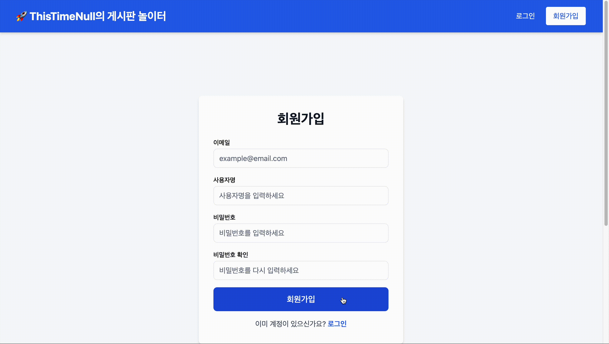
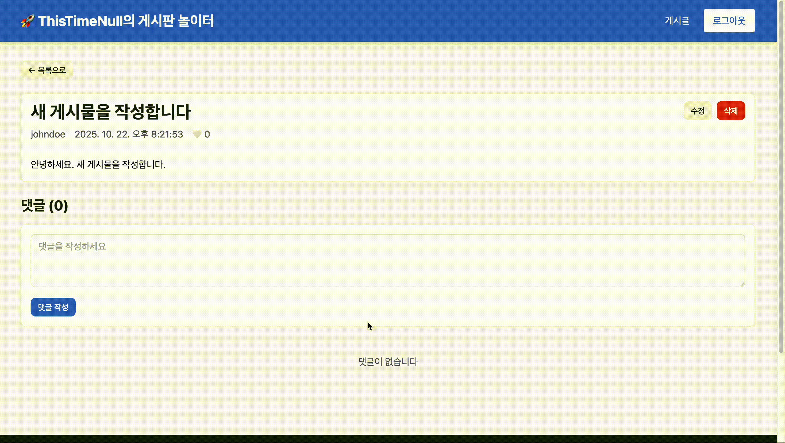
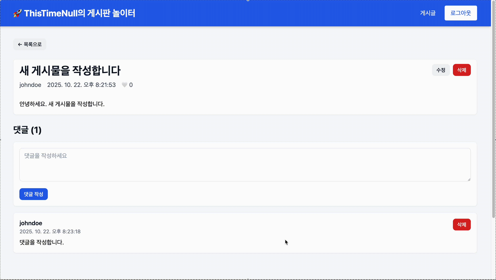
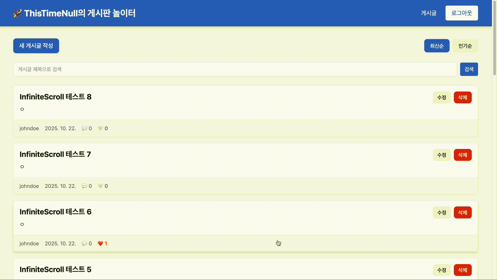
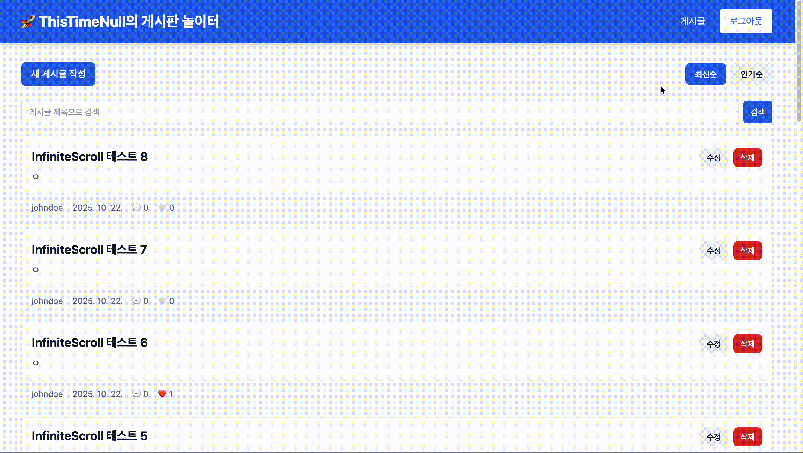
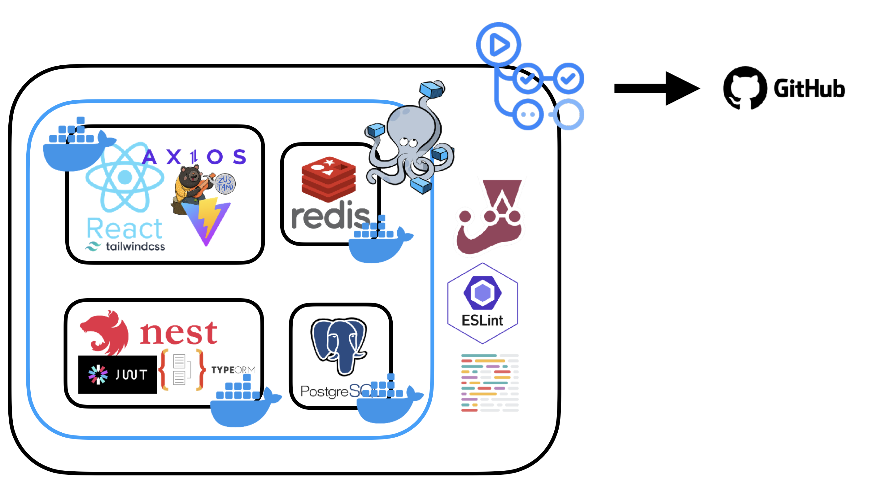

# 정글 10기 | 실력 다지기 프로젝트 - 풀스택 CRUD 애플리케이션

## 화면

### 주요 화면

| **메인 화면** | **게시글 상세 화면** |
|:---:|:---|
|  |  |

### 주요 기능

| **로그인 성공** | **로그인 실패** | **회원가입 유효성 검증** |
|:---:|:---:|:---:|
|  |  |  |

| **게시글 작성** | **게시글 수정** | **댓글 작성** |
|:---:|:---:|:---:|
|  |  |  |

| **댓글 삭제** | **좋아요 기능** | **검색 기능** |
|:---:|:---:|:---:|
|  |  |  |

| **정렬 기능** | **무한 스크롤** |
|:---:|:---:|
|  |  |

## 아키텍처

## 문서

### 개요
- [기술 스택](./docs/stack.md)
- [프로젝트 구조 및 실행 방법](./docs/about-project.md)

### 프론트엔드
- [Axios : 인터셉터](./docs/frontend/axios-interceptor.md)
- [Infinite Scroll](./docs/frontend/infinite-scroll.md)
- [React 최적화](./docs/frontend/react-optimization.md)
- [useEffect Cleanup](./docs/frontend/useEffect-cleanup.md)

### 백엔드
- [ConfigService](./docs/backend/config-service.md)
- [CurrentUser Decorator](./docs/backend/current-user-decorator.md)
- [DTO & Entity](./docs/backend/dto-and-entity.md)
- [Service & Controller](./docs/backend/service-and-controller.md)
- [JwtAuthGuard](./docs/backend/jwt-auth-guard.md)
- [Jwt Strategy](./docs/backend/jwt.strategy.md)
- [Passport](./docs/backend/passport.md)
- [useFactory](./docs/backend/use-factory.md)